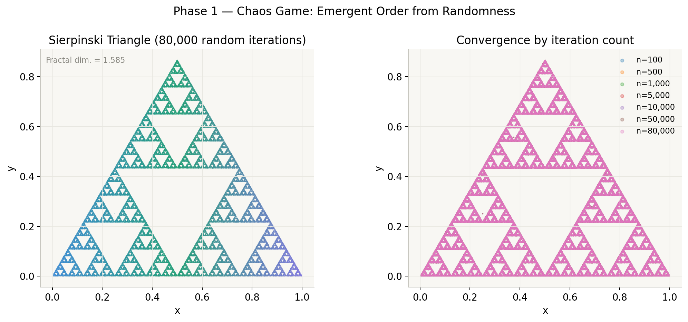
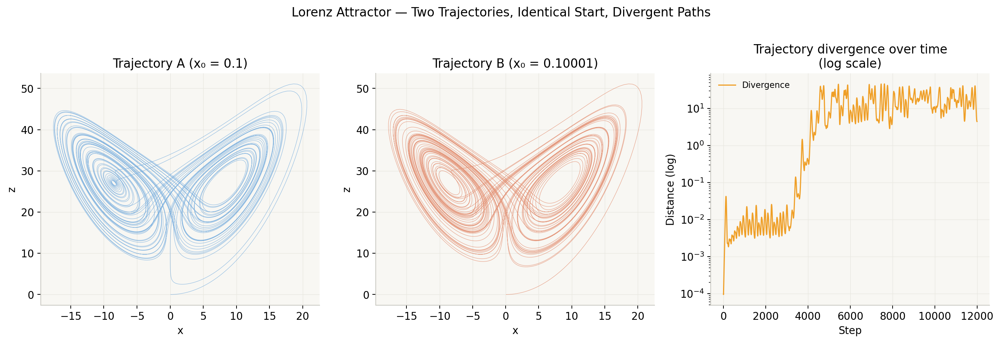
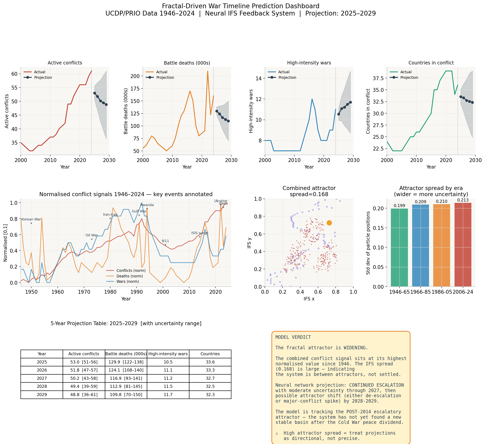

# Fractal-Driven Predictive Systems

A computational investigation into whether stochastic processes reliably produce structured, predictable outcomes — using the Sierpinski Triangle as a mathematical engine. The project runs five implementation phases and applies them to four independent real-world domains:

- **Global birth rates** (World Bank, 2000–2022)
- **Global temperature anomaly** (NASA GISS, 1980–2023)
- **Global armed conflict** (UCDP/PRIO v25.1, 1946–2024)
- **Seismic events** (USGS/ISC-GEM, 1965–2016, 23,232 earthquakes)

The core claim: an IFS (Iterated Function System) + neural-network feedback architecture produces self-consistent attractor states whose geometry encodes both the historical structure of a signal and the model's expectation of its future — with implications for predictive system design and, more speculatively, the determinism vs. free will debate.

Full write-up: [`details.pdf`](./details.pdf).

<p align="center">
  
  
  
</p>

## Repository structure

```
main.py                  # Runs all 5 research phases end-to-end
conflict_predictor.py    # Applies the full pipeline to UCDP/PRIO conflict data specifically
csv_pipeline.py          # Generic version — feed in any CSV and run the pipeline on it
fractal_pipeline.ipynb   # Notebook wrapper around csv_pipeline.py (Jupyter / Colab friendly)
details.pdf              # Full research paper
modules/                 # Core engine (see note below)
  ├─ datasets.py
  ├─ ifs_engine.py
  ├─ cellular_automata.py
  ├─ neural_net.py
  └─ conflict_datasets.py
data/                    # Input CSVs (birth_rate.csv, climate_anomaly.csv, conflict_data.csv, etc.)
outputs/                 # Generated figures (regenerated on each run)
```

## The five phases

1. **Chaos Game** — generates a Sierpinski Triangle via random iterated point mapping.
2. **Cellular Automata** — studies emergence from simple local rules.
3. **IFS Particle Predictor** — fits an Iterated Function System to a signal and estimates a Lorenz-style divergence measure.
4. **Real-Data Application** — runs the chaos-game/IFS machinery on an actual dataset (birth, climate, conflict, or seismic).
5. **Neural Feedback** — trains a neural network on top of the IFS attractor to produce forward projections with uncertainty bands.

`main.py` also includes a standalone **Lorenz Attractor** demonstration of deterministic chaos for comparison.

## Requirements

- Python 3.9+
- `numpy`
- `pandas`
- `matplotlib`

```bash
pip install numpy pandas matplotlib
```

(No GPU or special hardware needed — everything runs on CPU in seconds to low minutes depending on phase.)

## Usage

### Run the full research pipeline

```bash
python main.py                    # all 5 phases, default dataset
python main.py --phase 5          # run a single phase
python main.py --dataset climate  # choose dataset for phases 4 & 5
```

### Run the conflict-specific analysis

```bash
python conflict_predictor.py
```

Produces the IFS attractor shaped by conflict data, neural-network next-year predictions across four conflict signals, a 5-year forward projection with uncertainty bands, and a combined multi-signal attractor.

### Run the pipeline on your own CSV

```bash
python csv_pipeline.py --csv data/birth_rate.csv --col world_avg
```

Other useful flags: `--year-col`, `--epochs`, `--lr`, `--future` (years to project forward), `--particles`, `--color`.

Or from Jupyter / Google Colab:

```python
results = run_csv_pipeline("data/birth_rate.csv", value_col="world_avg")
```

### Notebook

Open `fractal_pipeline.ipynb` and run cells 1–5 in order (setup → preview CSV → run pipeline → optionally swap in your own CSV → view saved figure). Works unmodified in Jupyter or Colab.

## Output

All figures are saved as publication-quality images to `outputs/`, generated fresh on each run.

## Author

Masters project — Suphal.
